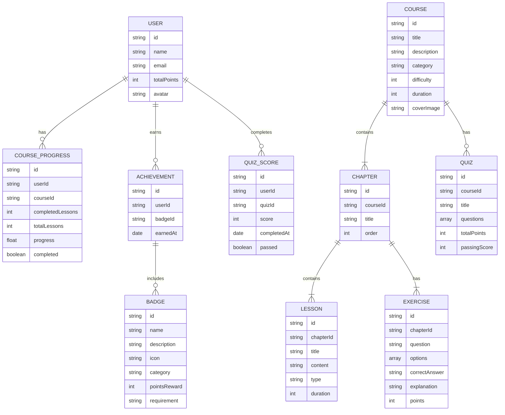

## 1. Architecture Design
采用纯前端架构，部署在Cloudflare Pages，使用本地存储和Zustand状态管理，无需后端服务器。

```mermaid
graph TB
    subgraph "Frontend (React + Vite)"
        A[Pages] --> B[Components]
        A --> C[State Management]
        B --> D[Utils]
        C --> E[Local Storage]
    end
    subgraph "Deployment"
        F[Cloudflare Pages]
    end
    Frontend --&gt; Deployment
```

## 2. Technology Description
- **Frontend**: React@18 + TypeScript + TailwindCSS@3 + Vite
- **Initialization Tool**: vite-init (react-ts template)
- **State Management**: Zustand
- **Routing**: React Router DOM
- **Icons**: lucide-react
- **Storage**: Local Storage (localStorage)
- **Deployment**: Cloudflare Pages (静态部署)

## 3. Route Definitions
| Route | Purpose |
|-------|---------|
| / | 首页 - 平台概览、课程展示、成就预览 |
| /courses | 课程体系 - 所有课程列表、分类筛选 |
| /courses/:id | 课程详情 - 课程介绍、章节列表 |
| /learn/:courseId/:chapterId | 学习页面 - 学习内容、在线练习 |
| /quiz/:courseId | 测评页面 - 综合测试、成绩报告 |
| /achievements | 成就系统 - 徽章墙、积分排行榜 |
| /profile | 个人中心 - 学习记录、进度统计 |

## 4. Data Model
### 4.1 Data Model Definition


### 4.2 Initial Data Structure
平台将包含以下初始数据（存储在前端代码中）：

**课程体系**:
1. Python数据分析基础
2. 商业数据可视化
3. 统计分析与应用
4. 机器学习入门
5. 数据分析实战项目

**成就徽章**:
- 初学者徽章 (完成第一个课程)
- 学习达人 (连续学习7天)
- 练习高手 (完成50道练习题)
- 测评达人 (所有测评成绩80分以上)
- 全栈分析师 (完成所有课程)

## 5. File Structure
```
/workspace
├── src/
│   ├── components/
│   │   ├── Navbar.tsx
│   │   ├── CourseCard.tsx
│   │   ├── ProgressBar.tsx
│   │   ├── Badge.tsx
│   │   └── QuizQuestion.tsx
│   ├── pages/
│   │   ├── Home.tsx
│   │   ├── Courses.tsx
│   │   ├── CourseDetail.tsx
│   │   ├── Learn.tsx
│   │   ├── Quiz.tsx
│   │   ├── Achievements.tsx
│   │   └── Profile.tsx
│   ├── hooks/
│   │   └── useStore.ts (Zustand store)
│   ├── utils/
│   │   ├── data.ts (初始课程数据)
│   │   └── helpers.ts
│   ├── App.tsx
│   ├── main.tsx
│   └── index.css
├── .trae/
│   └── documents/
│       ├── prd.md
│       └── arch.md
├── package.json
├── tsconfig.json
├── vite.config.ts
├── tailwind.config.js
└── postcss.config.js
```

## 6. State Management (Zustand)
```typescript
interface StoreState {
    user: User | null;
    courses: Course[];
    courseProgress: CourseProgress[];
    achievements: Achievement[];
    badges: Badge[];
    quizScores: QuizScore[];
    // Actions
    setUser: (user: User) => void;
    updateCourseProgress: (courseId: string, progress: number) => void;
    unlockAchievement: (badgeId: string) => void;
    addQuizScore: (quizId: string, score: number, passed: boolean) => void;
}
```

## 7. Cloudflare Pages Deployment
- 使用 `vite build` 生成静态文件
- 部署目录: `dist/`
- 构建命令: `npm run build`
- 无服务器端路由，使用前端路由 (React Router)
