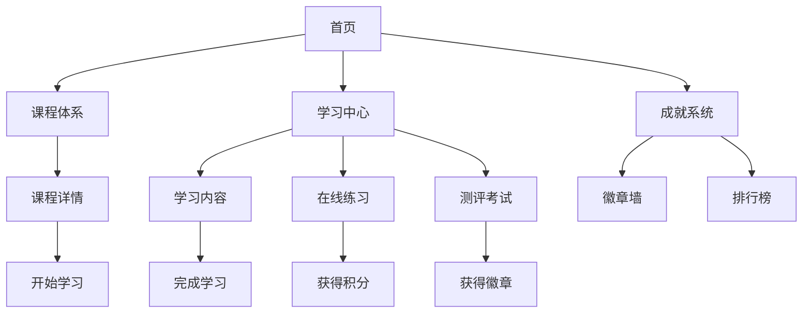

## 1. Product Overview
数据分析在线教育平台，为商务数据分析与应用专业学生提供系统化课程体系、互动式学习和成就激励
- 主要目标：构建专业级数据分析学习平台，包含学、练、测评全流程
- 目标用户：商务数据分析与应用专业的学生
- 市场价值：填补专业数据分析在线教育空白，提升学生实战能力

## 2. Core Features

### 2.1 User Roles
| Role | Registration Method | Core Permissions |
|------|---------------------|------------------|
| Student | Email/账号密码登录 | 访问课程、完成练习、参加测评、获取成就 |

### 2.2 Feature Module
1. **首页**: 课程概览、学习进度、成就展示
2. **课程体系**: 完整的课程目录、章节结构
3. **互动学习**: 学习内容、在线练习、测评考试
4. **成就系统**: 成就徽章、学习积分、排行榜

### 2.3 Page Details
| Page Name | Module Name | Feature description |
|-----------|-------------|---------------------|
| 首页 | 导航栏 | Logo、课程、学习、成就、个人中心 |
| 首页 | Hero区域 | 平台介绍、核心特色、开始学习按钮 |
| 首页 | 课程概览 | 展示核心课程、学习进度 |
| 首页 | 成就展示 | 最近获得的徽章、学习积分 |
| 课程体系 | 课程列表 | 所有课程卡片、分类筛选 |
| 课程体系 | 课程详情 | 课程介绍、章节列表、学习目标 |
| 课程学习 | 学习内容 | 视频/图文内容、知识点讲解 |
| 课程学习 | 在线练习 | 交互式习题、实时反馈 |
| 课程学习 | 测评考试 | 综合测试、成绩报告 |
| 成就系统 | 徽章墙 | 所有成就徽章展示 |
| 成就系统 | 积分排行榜 | 学习积分排名 |
| 个人中心 | 学习记录 | 学习历史、进度统计 |

## 3. Core Process
学生登录平台后，浏览课程体系选择感兴趣的课程，进入学习模块完成课程内容学习、在线练习和测评考试，通过学习获得成就徽章和积分，激励持续学习。

## 4. User Interface Design

### 4.1 Design Style
- **主色调**: 深蓝色 (#1e40af) + 天蓝色 (#3b82f6) - 专业、科技感
- **辅助色**: 橙色 (#f59e0b) - 用于强调和激励元素
- **按钮风格**: 圆角矩形、平滑渐变、悬停效果
- **字体**: Inter + Playfair Display - 现代感与专业感结合
- **布局风格**: 卡片式布局、清晰的信息层级
- **图标风格**: Lucide图标库，线性风格

### 4.2 Page Design Overview
| Page Name | Module Name | UI Elements |
|-----------|-------------|-------------|
| 首页 | Hero区域 | 渐变背景、大标题、动画效果、CTA按钮 |
| 首页 | 课程概览 | 卡片网格、进度条、悬停效果 |
| 课程体系 | 课程列表 | 分类标签、筛选功能、课程卡片 |
| 课程学习 | 学习界面 | 分栏布局、内容区域、侧边导航 |
| 成就系统 | 徽章墙 | 网格布局、徽章动画、解锁状态 |
| 成就系统 | 排行榜 | 列表布局、头像、积分、排名标识 |

### 4.3 Responsiveness
- 桌面端优先设计，自适应平板和移动端
- 响应式断点：1200px、768px、480px
- 触摸优化：增大点击区域、优化手势操作

### 4.4 Animations & Interactions
- 页面加载时的渐入动画
- 卡片悬停时的上浮效果
- 徽章获得时的庆祝动画
- 平滑滚动和过渡效果
- 进度更新时的动画反馈
